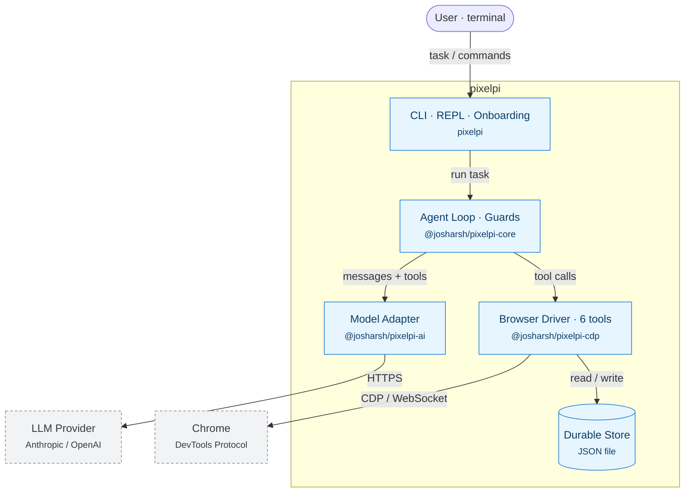
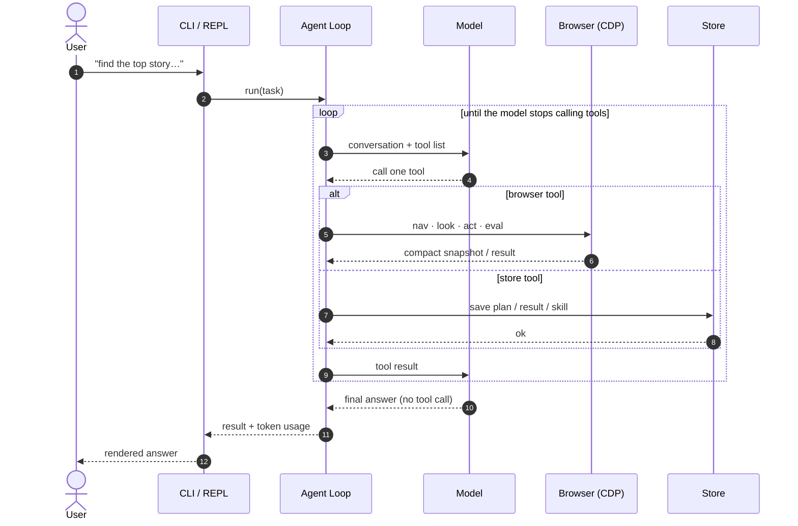

# How pixelpi works

pixelpi lets a language model drive a real web browser. The model is the brain; pixelpi is the hands and eyes. Instead of a big toolbox, it gives the model six small tools and lets it compose them.

This page explains the moving parts and walks through what happens during a single task. No prior context needed.

---

## The one-sentence version

The model looks at a page, decides on one small action, pixelpi carries it out in Chrome, the model sees the result, and it repeats until the task is done.

---

## The six tools

That whole loop runs on six primitives. Nothing else is hard-wired.

| Tool | What it does |
|------|--------------|
| `look` | Takes a compact, labelled snapshot of the page (what's on screen, by name). |
| `act` | Clicks, types, selects, hovers, or scrolls a single element. |
| `fill` | Fills many form fields in one shot. |
| `nav` | Goes to a URL, navigates history, waits for content, switches tabs. |
| `eval` | Runs JavaScript inside the page — the power tool everything else composes from. |
| `store` | Saves and recalls durable data: plans, results, and reusable skills. |

If a task needs something exotic, the model writes JavaScript with `eval` rather than reaching for a tool that doesn't exist.

---

## The pieces

pixelpi is four small packages with one job each.

| Package | Its job |
|---------|---------|
| `pixelpi` | The face — the CLI, the interactive chat, first-run setup, and how steps are shown. |
| `@josharsh/pixelpi-core` | The brainstem — the turn loop, retries, loop/limit guards, and storage. |
| `@josharsh/pixelpi-cdp` | The hands and eyes — talks to Chrome over the raw DevTools Protocol and implements the six tools. |
| `@josharsh/pixelpi-ai` | The translator — one interface over Anthropic and OpenAI. |

They depend in a straight line: `agent → core → cdp` and `core → ai`. The loop knows nothing about browsers; the tools are handed to it.

---

## Architecture (C4 container view)

Read it top-down: your task enters through the CLI, the loop runs the conversation, and it talks outward two ways — to the **model** (over HTTPS) to think, and to the **browser driver** (over the DevTools Protocol) to act. The driver is also the only thing that touches the durable store. Dashed boxes are outside pixelpi.

---

## One task, start to finish

The loop ends the moment the model replies without asking for a tool. There's no special "done" command — silence is the signal.

---

## Why it's built this way

Three choices do most of the work.

**Small eyes.** `look` doesn't send raw HTML or screenshots. It sends the page's accessibility tree — the same structured view a screen reader uses, pruned to what matters. On heavy sites that's tens to a hundred times fewer tokens, and the size stays bounded no matter how bloated the page is.

**One escape hatch.** `eval` runs arbitrary JavaScript in the page. From there the model can reach the DOM, the network, and storage — so a loop or a bulk extraction happens *inside the page* in one call, instead of a dozen round-trips that each cost tokens.

**It remembers.** The model can write reusable skills and cache the decision behind an action (which element, which step) in the store. Next time, that work replays for almost nothing.

---

## Two sides of one boundary

pixelpi lives in two worlds, and keeping them separate is what makes it safe and durable.

- **Driver side** — your machine. The loop, your API key, and the store live here. Privileged and persistent.
- **In-page side** — the website's world. The JavaScript pixelpi injects runs here. Sandboxed and temporary; the page can't see your key.

One detail bridges them: clicks and keystrokes are injected at the *browser* level, not faked in page JavaScript, so sites treat them as real input rather than a script. Without that, an agent works on a toy page and stalls on a real one.

---

See [`../README.md`](../README.md) for the quick start and the project pitch.
